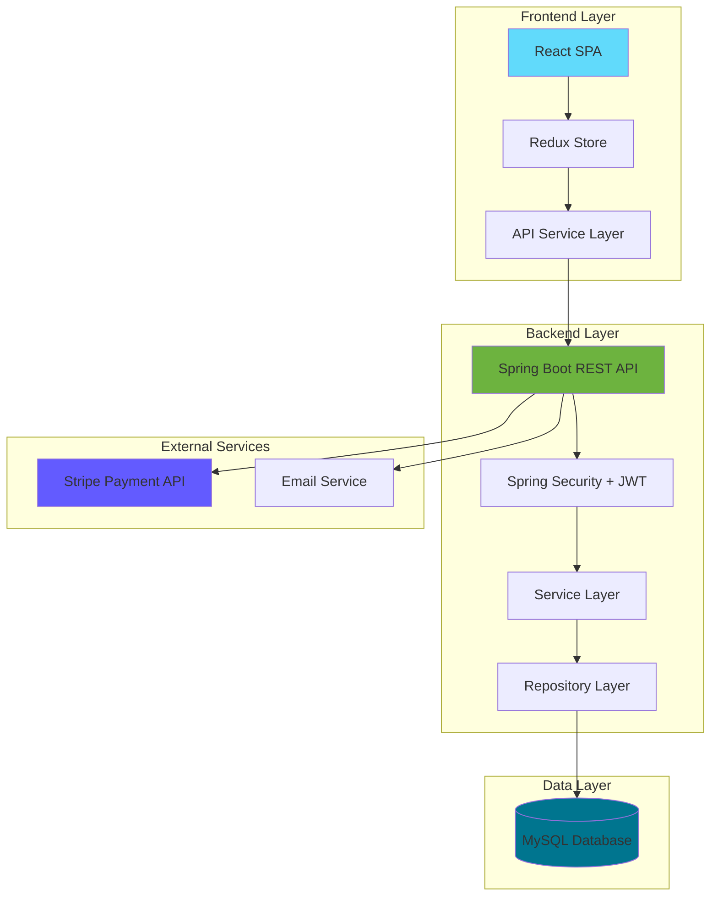

# 🍔 CraveHub - Full Stack Food Ordering Platform

<div align="center">


**A modern, full-stack food delivery platform with real-time order management, secure payments, and multi-role access control.**

[Features](#-key-features) • [Tech Stack](#-tech-stack) • [Getting Started](#-getting-started) • [API Documentation](#-api-endpoints) • [Screenshots](#-screenshots)

</div>

---

## 📋 Table of Contents

- [Overview](#-overview)
- [Key Features](#-key-features)
- [Tech Stack](#-tech-stack)
- [System Architecture](#-system-architecture)
- [Getting Started](#-getting-started)
- [API Endpoints](#-api-endpoints)
- [Project Structure](#-project-structure)
- [Configuration](#-configuration)
- [Contributing](#-contributing)
- [License](#-license)

---

## 🌟 Overview

**CraveHub** is a comprehensive food ordering and delivery management system built with modern technologies. It provides a seamless experience for customers to browse restaurants, place orders, and track deliveries, while offering restaurant owners powerful tools to manage their menus, orders, and business operations.

### 🎯 Target Users

- **👥 Customers**: Browse restaurants, order food, track deliveries, and manage favorites
- **🏪 Restaurant Owners**: Manage menus, process orders, track revenue, and handle inventory
- **👨‍💼 Super Admins**: Oversee platform operations, manage restaurants, and monitor system health

---

## ✨ Key Features

### 🔐 Authentication & Security
- **JWT-based Authentication**: Secure token-based authentication system
- **Role-based Access Control**: Separate portals for Customers, Restaurant Owners, and Super Admins
- **Password Reset**: Email-based password recovery system
- **Spring Security Integration**: Enterprise-grade security implementation

### 🍽️ Restaurant Management
- **Restaurant CRUD Operations**: Complete restaurant profile management
- **Menu Management**: Add, update, and categorize food items
- **Ingredient Tracking**: Manage ingredients and stock levels
- **Category Organization**: Organize menu items by categories
- **Restaurant Events**: Create and manage special events and promotions
- **Open/Close Status**: Real-time restaurant availability management

### 🛒 Order Management
- **Smart Cart System**: Real-time cart updates with item customization
- **Order Tracking**: Live order status updates (PENDING → PREPARING → READY → DELIVERED)
- **Order History**: Complete order history for customers and restaurants
- **Admin Order Management**: Restaurant owners can update order status
- **Notifications**: Real-time order notifications

### 💳 Payment Integration
- **Stripe Payment Gateway**: Secure payment processing
- **Multiple Payment Methods**: Support for various payment options
- **Payment History**: Transaction tracking and history

### 📱 User Experience
- **Responsive Design**: Optimized for desktop, tablet, and mobile devices
- **Material UI Components**: Modern, accessible UI components
- **Real-time Updates**: Live updates using Redux state management
- **Search & Filter**: Advanced restaurant and food item search
- **Reviews & Ratings**: Customer feedback system
- **Favorites**: Save favorite restaurants and items

### 👨‍💼 Admin Features
- **Dashboard Analytics**: Business insights and statistics
- **Restaurant Approval**: Manage restaurant onboarding
- **User Management**: Monitor and manage platform users
- **System Monitoring**: Platform health and performance metrics

---

## 🛠️ Tech Stack

### Backend (Spring Boot)

| Technology | Version | Purpose |
|------------|---------|---------|
| **Java** | 17 | Programming Language |
| **Spring Boot** | 3.1.3 | Application Framework |
| **Spring Security** | 6.x | Security & Authentication |
| **Spring Data JPA** | 3.x | Data Persistence |
| **MySQL** | 8.x | Relational Database |
| **JWT (jjwt)** | 0.11.1 | Token Authentication |
| **Stripe API** | 20.62.0 | Payment Processing |
| **Spring Mail** | 3.x | Email Services |
| **Lombok** | Latest | Code Generation |
| **Maven** | 3.x | Build Tool |

### Frontend (React)

| Technology | Version | Purpose |
|------------|---------|---------|
| **React** | 18.2.0 | UI Framework |
| **Redux** | 4.2.1 | State Management |
| **React Router** | 6.15.0 | Client-side Routing |
| **Material UI** | 5.14.6 | UI Component Library |
| **Axios** | 1.5.0 | HTTP Client |
| **Formik** | 2.4.4 | Form Management |
| **Yup** | 1.2.0 | Form Validation |
| **Tailwind CSS** | 3.3.3 | Utility-first CSS |
| **React Slick** | 0.29.0 | Carousel Component |
| **Day.js** | 1.11.10 | Date Manipulation |

---

## 🏗️ System Architecture



### Architecture Highlights

- **RESTful API Design**: Clean, resource-based API endpoints
- **Layered Architecture**: Controller → Service → Repository pattern
- **State Management**: Centralized Redux store for predictable state updates
- **Security**: JWT tokens with role-based access control
- **Database**: Normalized MySQL schema with JPA relationships

---

## 🚀 Getting Started

### Prerequisites

Before you begin, ensure you have the following installed:

- **Java JDK 17+** ([Download](https://www.oracle.com/java/technologies/downloads/))
- **Node.js 14+** and npm ([Download](https://nodejs.org/))
- **MySQL 8.x** ([Download](https://dev.mysql.com/downloads/))
- **Maven 3.x** (Included via Maven Wrapper)
- **Git** ([Download](https://git-scm.com/))

### Installation Steps

#### 1️⃣ Clone the Repository

```bash
git clone https://github.com/himanshugupta91/Full-Stack-Food-Ordering-Website-.git
cd Full-Stack-Food-Ordering-Website-
```

#### 2️⃣ Database Setup

Create a MySQL database:

```sql
CREATE DATABASE food_ordering_db;
```

#### 3️⃣ Backend Configuration

Navigate to the backend directory:

```bash
cd "backend-spring boot"
```

Update `src/main/resources/application.properties`:

```properties
# Database Configuration
spring.datasource.url=jdbc:mysql://localhost:3306/food_ordering_db
spring.datasource.username=YOUR_MYSQL_USERNAME
spring.datasource.password=YOUR_MYSQL_PASSWORD

# JPA Configuration
spring.jpa.hibernate.ddl-auto=update
spring.jpa.show-sql=true

# JWT Configuration
jwt.secret=YOUR_SECRET_KEY_HERE

# Stripe Configuration
stripe.api.key=YOUR_STRIPE_SECRET_KEY

# Email Configuration
spring.mail.host=smtp.gmail.com
spring.mail.port=587
spring.mail.username=YOUR_EMAIL
spring.mail.password=YOUR_EMAIL_PASSWORD
```

Start the backend server:

```bash
./mvnw spring-boot:run
```

**Backend runs on:** `http://localhost:5454`

#### 4️⃣ Frontend Configuration

Open a new terminal and navigate to the frontend directory:

```bash
cd "frontend-react"
```

Install dependencies:

```bash
npm install
```

Update API endpoint in `src/config/api.js` (if needed):

```javascript
export const API_BASE_URL = 'http://localhost:5454';
```

Start the frontend development server:

```bash
npm start
```

**Frontend runs on:** `http://localhost:3000`

#### 5️⃣ Access the Application

- **Customer Portal**: `http://localhost:3000`
- **Restaurant Admin**: `http://localhost:3000/admin`
- **Super Admin**: `http://localhost:3000/super-admin`

---

## 📡 API Endpoints

### Authentication

| Method | Endpoint | Description | Access |
|--------|----------|-------------|--------|
| POST | `/auth/signup` | Register new user | Public |
| POST | `/auth/signin` | User login | Public |
| POST | `/auth/reset-password` | Reset password | Public |

### User Management

| Method | Endpoint | Description | Access |
|--------|----------|-------------|--------|
| GET | `/api/users/profile` | Get user profile | Authenticated |
| PUT | `/api/users/profile` | Update profile | Authenticated |

### Restaurant Operations

| Method | Endpoint | Description | Access |
|--------|----------|-------------|--------|
| GET | `/api/restaurants` | Get all restaurants | Public |
| GET | `/api/restaurants/{id}` | Get restaurant details | Public |
| POST | `/api/admin/restaurants` | Create restaurant | Owner |
| PUT | `/api/admin/restaurants/{id}` | Update restaurant | Owner |
| DELETE | `/api/admin/restaurants/{id}` | Delete restaurant | Owner |
| PUT | `/api/admin/restaurants/{id}/status` | Update restaurant status | Owner |

### Menu Management

| Method | Endpoint | Description | Access |
|--------|----------|-------------|--------|
| GET | `/api/food/restaurant/{id}` | Get restaurant menu | Public |
| POST | `/api/admin/food` | Add menu item | Owner |
| PUT | `/api/admin/food/{id}` | Update menu item | Owner |
| DELETE | `/api/admin/food/{id}` | Delete menu item | Owner |

### Category Management

| Method | Endpoint | Description | Access |
|--------|----------|-------------|--------|
| GET | `/api/category/restaurant/{id}` | Get categories | Public |
| POST | `/api/admin/category` | Create category | Owner |

### Ingredient Management

| Method | Endpoint | Description | Access |
|--------|----------|-------------|--------|
| GET | `/api/admin/ingredients/restaurant/{id}` | Get ingredients | Owner |
| POST | `/api/admin/ingredients` | Add ingredient | Owner |
| PUT | `/api/admin/ingredients/{id}/stock` | Update stock | Owner |

### Cart Operations

| Method | Endpoint | Description | Access |
|--------|----------|-------------|--------|
| GET | `/api/cart` | Get user cart | Customer |
| POST | `/api/cart/add` | Add item to cart | Customer |
| PUT | `/api/cart-item/update` | Update cart item | Customer |
| DELETE | `/api/cart-item/{id}/remove` | Remove from cart | Customer |
| DELETE | `/api/cart/clear` | Clear cart | Customer |

### Order Management

| Method | Endpoint | Description | Access |
|--------|----------|-------------|--------|
| POST | `/api/order` | Create order | Customer |
| GET | `/api/order/user` | Get user orders | Customer |
| GET | `/api/admin/order/restaurant/{id}` | Get restaurant orders | Owner |
| PUT | `/api/admin/order/{id}/{status}` | Update order status | Owner |

### Payment Processing

| Method | Endpoint | Description | Access |
|--------|----------|-------------|--------|
| POST | `/api/payment/create` | Create payment intent | Customer |
| POST | `/api/payment/confirm` | Confirm payment | Customer |

### Events

| Method | Endpoint | Description | Access |
|--------|----------|-------------|--------|
| GET | `/api/events` | Get all events | Public |
| POST | `/api/admin/events/restaurant/{id}` | Create event | Owner |
| DELETE | `/api/admin/events/{id}` | Delete event | Owner |

### Reviews

| Method | Endpoint | Description | Access |
|--------|----------|-------------|--------|
| POST | `/api/reviews` | Submit review | Customer |
| GET | `/api/reviews/restaurant/{id}` | Get restaurant reviews | Public |

### Super Admin

| Method | Endpoint | Description | Access |
|--------|----------|-------------|--------|
| GET | `/api/super-admin/restaurants` | Get all restaurants | Super Admin |
| PUT | `/api/super-admin/restaurants/{id}/approve` | Approve restaurant | Super Admin |

---

## 📁 Project Structure

### Backend Structure

```
backend-spring boot/
├── src/
│   ├── main/
│   │   ├── java/com/codeStorm/
│   │   │   ├── config/              # Security & App configuration
│   │   │   ├── controller/          # REST API endpoints (17 controllers)
│   │   │   ├── model/               # JPA entities (19 models)
│   │   │   ├── repository/          # Data access layer (15 repositories)
│   │   │   ├── service/             # Business logic (28 services)
│   │   │   ├── request/             # Request DTOs (11 classes)
│   │   │   ├── response/            # Response DTOs
│   │   │   ├── Exception/           # Custom exceptions
│   │   │   ├── domain/              # Domain enums
│   │   │   └── dto/                 # Data transfer objects
│   │   └── resources/
│   │       └── application.properties
│   └── test/                        # Unit & integration tests
├── pom.xml                          # Maven dependencies
└── README.md
```

### Frontend Structure

```
frontend-react/
├── public/                          # Static assets
├── src/
│   ├── Admin/                       # Restaurant admin portal (24 components)
│   ├── SuperAdmin/                  # Super admin portal (9 components)
│   ├── customers/                   # Customer-facing components (37 components)
│   ├── Routers/                     # Route configurations
│   ├── State/                       # Redux store & actions (32 files)
│   ├── config/                      # API & app configuration
│   ├── theme/                       # MUI theme customization
│   ├── Data/                        # Static data & constants
│   ├── App.js                       # Root component
│   └── index.js                     # Entry point
├── package.json                     # Dependencies
├── tailwind.config.js               # Tailwind configuration
└── README.md
```

---

## ⚙️ Configuration

### Environment Variables

Create a `.env` file in the backend directory:

```env
# Database
DB_URL=jdbc:mysql://localhost:3306/food_ordering_db
DB_USERNAME=root
DB_PASSWORD=yourpassword

# JWT
JWT_SECRET=your-secret-key-min-256-bits
JWT_EXPIRATION=86400000

# Stripe
STRIPE_SECRET_KEY=sk_test_your_stripe_key

# Email
MAIL_USERNAME=your-email@gmail.com
MAIL_PASSWORD=your-app-password

# Server
SERVER_PORT=5454
```

### CORS Configuration

The backend is configured to accept requests from `http://localhost:3000`. Update `config/WebConfig.java` for production:

```java
@Override
public void addCorsMappings(CorsRegistry registry) {
    registry.addMapping("/**")
            .allowedOrigins("https://your-production-domain.com")
            .allowedMethods("GET", "POST", "PUT", "DELETE", "OPTIONS");
}
```

---

## 🧪 Testing

### Backend Tests

```bash
cd "backend-spring boot"
./mvnw test
```

### Frontend Tests

```bash
cd frontend-react
npm test
```

---

## 📸 Screenshots

> **Note**: Add screenshots of your application here to showcase the UI and features.

---

## 🤝 Contributing

Contributions are welcome! Please follow these steps:

1. **Fork the repository**
2. **Create a feature branch**: `git checkout -b feature/AmazingFeature`
3. **Commit your changes**: `git commit -m 'Add some AmazingFeature'`
4. **Push to the branch**: `git push origin feature/AmazingFeature`
5. **Open a Pull Request**

### Coding Standards

- Follow Java naming conventions for backend code
- Use ESLint and Prettier for frontend code
- Write meaningful commit messages
- Add unit tests for new features
- Update documentation as needed

---

## 📄 License

This project is licensed under the MIT License - see the [LICENSE](LICENSE) file for details.

---

## 👨‍💻 Author

**Himanshu Gupta**

- GitHub: [@himanshugupta91](https://github.com/himanshugupta91)
- LinkedIn: [Connect with me](https://linkedin.com/in/himanshugupta91)

---

## 🙏 Acknowledgments

- Spring Boot Team for the excellent framework
- React Team for the powerful UI library
- Material UI for beautiful components
- Stripe for payment processing
- All contributors and supporters

---

## 📞 Support

If you have any questions or need help, please:

- Open an issue on GitHub
- Contact via email
- Check existing documentation

---

<div align="center">

**⭐ Star this repository if you find it helpful!**

Made with ❤️ by Himanshu Gupta

</div>
